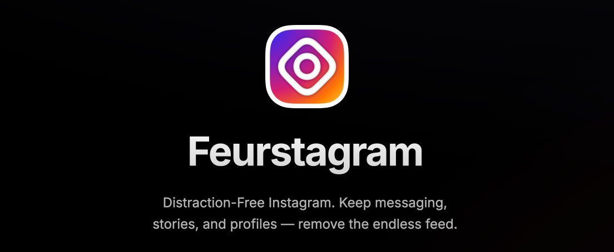
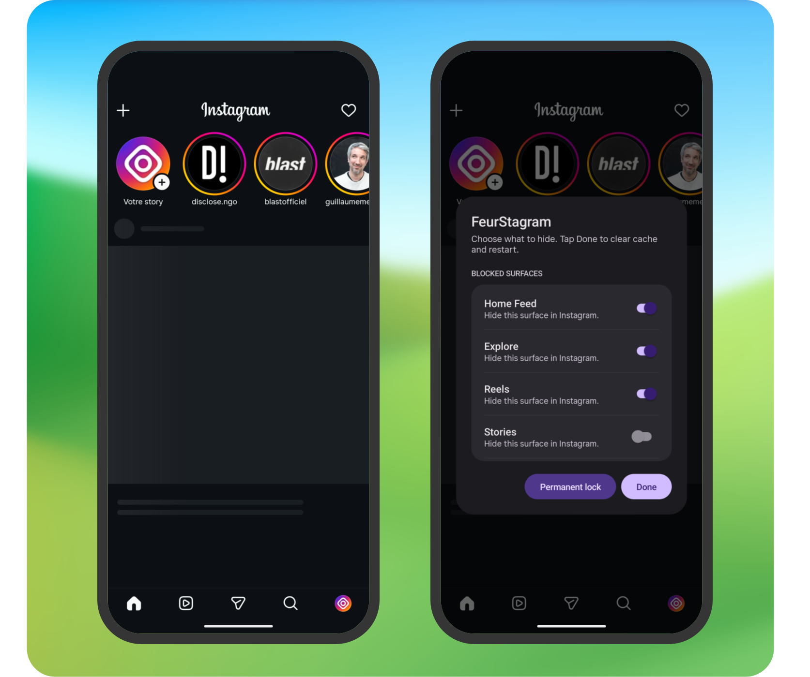

<div align="center">
  
  <h1>FeurStagram</h1>
  <p><strong>Instagram, without the addictive surfaces.</strong></p>
  <p>
    FeurStagram is an open-source Android patch for Instagram that removes
    the feed, Explore, Reels, ads, telemetry, and other distracting features
    while keeping DMs, stories, search, notifications, and profiles.
  </p>
</div>

<p align="center">
  <a href="https://github.com/jean-voila/FeurStagram/releases/latest"></a>
  <a href="https://github.com/jean-voila/FeurStagram/releases/latest"></a>
  <a href="LICENSE"></a>
  <a href="https://discord.gg/Z9QvMw8s76"></a>
  <a href="https://www.instagram.com/feurstagram_official/"></a>
</p>

<p align="center">
  <a href="https://github.com/sponsors/jean-voila"></a>
</p>

<p align="center">
  <a href="https://github.com/jean-voila/FeurStagram/releases/latest"><strong>Download APK</strong></a>
  ·
  <a href="docs/INSTALL.md">Install</a>
  ·
  <a href="docs/BUILD_FROM_SOURCE.md">Build from source</a>
  ·
  <a href="docs/FAQ.md">FAQ</a>
  ·
  <a href="docs/PRIVACY.md">Privacy</a>
  ·
  <a href="https://github.com/sponsors/jean-voila">Support</a>
  ·
  <a href="https://github.com/jean-voila/FeurStagram/issues">Issues</a>
</p>

<p align="center">
  
</p>

## What it keeps and blocks

| Keep using Instagram for | Remove or block |
|--------------------------|-----------------|
| Direct Messages | Endless Home feed |
| Stories | Reels surfaces |
| Search and profiles | Explore and suggested-account recommendations |
| Notifications | Ads, shopping preloads, and telemetry |

## Preview

<p align="center">
  
</p>

<p align="center">
  
</p>

## Is it safe?

FeurStagram does not collect, proxy, store, or transmit your credentials.

It patches the official Instagram Android app to remove distracting features. The patches are open source and documented, so you can inspect what is changed.

For maximum trust, you can build the APK yourself instead of downloading a prebuilt release.

That said, FeurStagram is an unofficial project and is not affiliated with Instagram or Meta. It is a modified APK installed outside the Play Store, so Android may show installation warnings. Using a modified client may violate Instagram's terms of service. Use it at your own risk.

## What FeurStagram does NOT do

FeurStagram does not:

- bypass Instagram login;
- collect your password or session tokens;
- proxy your traffic through a third-party server;
- add tracking or analytics;
- scrape accounts;
- sell or transmit user data;
- claim affiliation with Instagram or Meta.

## Why FeurStagram?

Unlike WebView-based alternatives, FeurStagram patches the real Android Instagram app.

Unlike accessibility-service blockers, it does not simply react to the interface after it loads.

Unlike closed-source Instagram mods, every patch is public and auditable.

FeurStagram is built for people who want to keep Instagram's useful social features without the addictive parts.

I built this project for myself as an alternative to [DFInstagram](https://www.distractionfreeapps.com/) which hasn't been maintained for a long time and was difficult to update. I'm sharing it so others can do the same for themselves.

**This project is entirely free and open-source.** Feel free to fork, copy, enhance, or submit pull requests - do whatever you want with it!

## Documentation

- [Installation guide](docs/INSTALL.md)
- [Build from source](docs/BUILD_FROM_SOURCE.md)
- [FAQ](docs/FAQ.md)
- [Privacy](docs/PRIVACY.md)
- [Contributing](CONTRIBUTING.md)
- [Security policy](SECURITY.md)

## How do I get notified when there is a new update ?

There will be a story on **the official FeurStagram** account every time there is
an update:

- https://www.instagram.com/feurstagram_official/

Just follow this account and you will get a new story on each release.

## Community

Join the Discord server to get support, follow updates, and discuss development:

- https://discord.gg/Z9QvMw8s76

## Installation

You have two options:

1. **Ready-to-install APK** - Grab the latest patched APK from the [Releases](../../releases) page and install it directly
2. **DIY Patching** - Use the toolkit below to patch any Instagram version yourself

## What Gets Disabled

All content blocks are **individual runtime toggles** — long-press the Home
tab at the bottom-left of the main tab bar to open the FeurStagram settings
page and check/uncheck what you want blocked. A single APK covers every
combination.

| Feature | Default | Toggleable | How |
|---------|---------|------------|-----|
| **Home Feed** | Blocked | Yes | Network-level blocking |
| **Explore** | Blocked | Yes | Network-level blocking |
| **Reels** | Blocked | Yes | Network-level blocking + Tab hidden |
| **Stories** | Visible | Yes | Network-level blocking |
| **Suggested accounts** | Blocked | Yes | Network-level blocking |
| **Instants (+ button in DMs)** | Blocked | Yes | View visibility hidden |
| **Notes (text bubbles above DMs)** | Blocked | Yes | View visibility hidden |
| **Analytics & telemetry** | Blocked | No | Always blocked |
| **Shopping / commerce preloads** | Blocked | No | Always blocked |
| **Ads** | Blocked | No | Always blocked |


## What Still Works

| Feature | Status |
|---------|--------|
| **Direct Messages** | Works |
| **Profile** | Works |
| **Reels in DMs** | Works |
| **Search** | Works |
| **Notifications** | Works |

## Settings Page

**Long-press the Home tab** (the house icon at the bottom-left of Instagram's
main tab bar). A full-screen, scrollable settings page opens with:

- **Blocked surfaces** — toggles for Home Feed, Explore, Reels, Stories,
  Suggested accounts, Instants, and Notes.
- **Landing page** — choose which surface the app jumps to on cold start
  (Home feed, Search, Direct messages, or Profile).
- **Donate** — opens the project's [GitHub Sponsors](https://github.com/sponsors/jean-voila) page.
- **Permanent lock** and **Done** buttons pinned at the bottom so they stay
  reachable on any screen size.

Changes persist across restarts (stored in SharedPreferences
`feurstagram_prefs`).

Once you change any setting, the page can only be left by restarting: both
**Done** and **Back** clear the cache and relaunch, so a changed block can
never leave the app in a half-applied state with stale content still loaded.
If you open the page and change nothing, Back simply closes it.

### Permanent lock

The permanent lock freezes your restrictions for this installation. It only
prevents *relaxing* them: you can still make settings **stricter** (turn a
block on), but you cannot turn a block back off without reinstalling.

The freeze is captured per settings session, not the instant you flip a
switch. When you open the settings page, FeurStagram snapshots which surfaces
are currently blocked; only those stay frozen. A surface you turn on by
mistake during a session can still be turned back off **until you tap Done** —
Done clears the cache and restarts, which bakes the new state in as the next
snapshot. This means a stray tap on a surface (e.g. Stories) is recoverable
within the same session instead of forcing a reinstall.


## Requirements

### Linux
```bash
sudo apt install apktool android-sdk-build-tools openjdk-17-jdk python3
```

### macOS
```bash
brew install apktool android-commandlinetools openjdk python3
 sdkmanager "build-tools;34.0.0"
```

## Quick Start

1. **Download an Instagram APK** from [APKMirror](https://www.apkmirror.com/apk/instagram/instagram-instagram/) (arm64-v8a recommended)

2. **Run the patcher:**
   ```bash
   ./patch.sh instagram.apk
   ```

   Use `--clone` to install FeurStagram **alongside** a stock Instagram
   (different package ID, separate data, both apps on the same device):

   ```bash
   ./patch.sh --clone instagram.apk
   # or specify the cloned package ID explicitly:
   ./patch.sh --clone com.instagram.android.feurstagram instagram.apk
   ```

   Without `--clone`, the patched APK keeps Instagram's original package ID
   and installs as a replacement.

3. **Install the patched APK:**
   ```bash
   adb install -r artifacts/feurstagram_patched_<instagram_apk_name>.apk
   ```

4. **Cleanup build artifacts:**
   ```bash
   ./cleanup.sh
   ```

## File Structure

```
Feurstagram/
├── patch.sh                       # Main patching script
├── cleanup.sh                     # Removes build artifacts
├── apply_network_patch.py         # Network hook patch logic
├── apply_longpress_patch.py       # Injects the long-press hook on the Home tab
├── apply_clone_patch.py           # --clone: rewrites the binary AndroidManifest.xml
│                                  #          and resources.arsc, then propagates
│                                  #          authority + package renames into smali
├── artifacts/                     # Patched APK output directory
└── patches/
    ├── FeurConfig.smali                  # SharedPreferences-backed toggles + landing page
    ├── FeurHooks.smali                   # Network blocking hooks
    ├── FeurSettings.smali                # Full-screen settings page entry point
    ├── FeurLandingListener.smali         # Persists the landing-page choice
    ├── FeurLandingWatcher.smali          # Redirects to the chosen surface on launch
    ├── FeurHomeTabWatcher.smali          # Finds feed_tab in the tab_bar
    ├── FeurInstantsHider.smali           # Hides the DM "Instants" + button
    ├── FeurNotesHider.smali              # Hides the DM Notes tray (cf_hub_recycler_view)
    └── FeurSettingsLongClick.smali       # View.OnLongClickListener shim
```

## Keystore

The patched APK needs to be signed before installation. The patcher uses a keystore file for signing.

### Generating a Keystore

Create a local keystore (do not commit it), then run `patch.sh` with env vars:

```bash
FEURSTAGRAM_KEYSTORE=./feurstagram.keystore \
FEURSTAGRAM_KEYSTORE_PASS=your_store_password \
FEURSTAGRAM_KEY_ALIAS=feurstagram \
./patch.sh instagram.apk
```

If `feurstagram.keystore` doesn't exist yet, create one:

```bash
keytool -genkey -v -keystore feurstagram.keystore -alias feurstagram \
  -keyalg RSA -keysize 2048 -validity 10000 \
  -storepass android -keypass android \
  -dname "CN=Feurstagram, OU=Feurstagram, O=Feurstagram, L=Unknown, ST=Unknown, C=XX"
```

### Keystore Details

| Property | Value |
|----------|-------|
| Filename | `feurstagram.keystore` |
| Alias | `feurstagram` |
| Algorithm | RSA 2048-bit |
| Validity | 10,000 days |

> **Note:** If you reinstall the app, you must use the same keystore to preserve your data. Signing with a different keystore requires uninstalling the previous version first.

## Debugging

View logs to see what's being blocked:
```bash
adb logcat -s "Feurstagram:D"
```

## How It Works

Everything is network-based — there is no UI-level tab redirection. Reels,
Explore, Feed, Stories and suggested accounts are all blocked the same way (by
refusing their backend fetches), and each one is individually toggleable at
runtime through the settings page.

### Settings Hook
The patcher injects a watcher on the main tab bar binder (`LX/4jG`, the class
that stores the `tab_bar` ViewGroup in field `A0F`). The watcher resolves the
`feed_tab` resource id dynamically via `Resources.getIdentifier(...)`, grabs
the Home tab FrameLayout once it's laid out, and installs a long-press
listener on it. Long-pressing it opens a custom Material 3-styled dark
full-screen page: a scrollable list of `SwitchCompat` content toggles plus a
landing-page `RadioGroup`, all backed by `SharedPreferences`
(`feurstagram_prefs`), with the action buttons pinned at the bottom.

The same tab-bar hook also installs a landing-page watcher: on cold start it
resolves the chosen surface's tab id (`search_tab`, `direct_tab`,
`profile_tab`) and performs a click once it is laid out, so the app opens
directly on that surface instead of the Home feed.

### Network Blocking
Hooks into `TigonServiceLayer` (a named, non-obfuscated class). Before each
request, `FeurHooks.throwIfBlocked()` runs on the request URI; blocked calls
fail with an `IOException` so the stack unwinds cleanly.

#### Blocked network paths

| Path / pattern | Purpose | Toggleable |
|----------------|---------|------------|
| `/feed/timeline/` | Home feed posts | Yes |
| `/feed/reels_tray` | Stories tray | Yes |
| `/discover/topical_explore` | Explore tab content | Yes |
| `/clips/home/`, `/clips/discover`, `/clips/get_blend_medias/` | Reels feed + discovery + Blend reels | Yes |
| `/discover/ayml/`, `/discover/sectioned_ayml/`, `/discover/chaining/`, `/discover/recommended_accounts_for_category/`, `/discover/suggested_businesses/`, `/discover/recs_from_friends_suggestions/`, `/discover/recs_from_friends_user_info/`, `/discover/surface_with_su/`, `/discover/fetch_suggestion_details/`, `/discover/account_discovery/`, `/discover/reshare_suggestions/`, `/fbsearch/accounts_recs/`, `/friendships/feed_favorites_suggestions/`, `/friendships/share_to_friends_story_suggested_users/`, `/direct_v2/search_friending_suggestions/`, `/business/discovery/suggest_business/` | Suggested-account recommendations (profile "Suggested for you", stories-tray injected accounts, search null-state recs, post-follow chaining, friend/business suggestions) | Yes |
| `/logging/` | Client event logging | No |
| `/async_ads_privacy/` | Ad-related tracking | No |
| `/async_critical_notices/` | Engagement nudge analytics | No |
| `/api/v1/media/.../seen/` (path contains `/api/v1/media/` and `/seen`) | Post “seen” tracking | No |
| `/api/v1/fbupload/` | Telemetry upload | No |
| `/api/v1/stats/` | Performance / usage stats | No |
| `/api/v1/commerce/`, `/api/v1/shopping/`, `/api/v1/sellable_items/` | Shopping / commerce preloads | No |

Note: despite the name, `/feed/reels_tray` is the stories tray endpoint in Instagram internals.

Matching uses `String.contains()` on the URI path. Instagram changes URL shapes over time; adjust `patches/FeurHooks.smali` if a block stops matching.

## Updating for New Instagram Versions

I'll update this project to support new Instagram versions as they are released. When a new version comes out, I'll apply the necessary patches and release an updated APK.

1. TigonServiceLayer is a named class (doesn't change).

2. Apply the same patches.


## Contributing

This is a personal project I'm sharing with the community. Contributions are welcome!

- 🍴 **Fork it** - Make your own version
- 🔧 **Pull requests** - Improvements and fixes are appreciated
- 📋 **Copy it** - Use the code however you want
- ✨ **Enhance it** - Build something even better

## License

This project is released under the GNU General Public License v3.0. See [LICENSE](LICENSE) for details.
